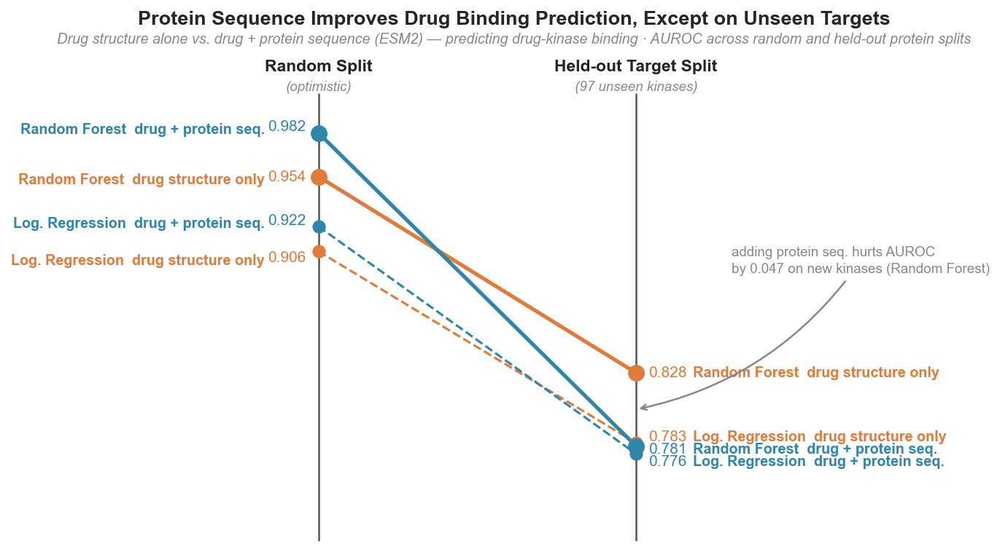

# bindscape: Drug-Target Interaction Prediction from Sequence Representations

Can a machine learning model predict whether a small molecule binds a protein target using only amino acid sequence and chemical structure, with no 3D structure, no docking, and no experimental data beyond binding affinity labels? This project tests that question on the most clinically relevant protein family in existence: human kinases. Each sample is a (drug, protein) pair. Drug → Morgan circular fingerprint (2048-bit, radius 2). Protein → ESM2 mean-pool embedding (`facebook/esm2_t30_150M_UR50D`, 640-dim). Label → 1 if Ki/IC50/Kd ≤ 1000 nM (binder), 0 if > 10,000 nM (non-binder); the ambiguous 1–10 μM band is dropped. On a random split, random forest with both representations achieves AUROC 0.982; logistic regression reaches 0.922. On 97 kinase targets withheld entirely from training, those numbers drop to 0.781 and 0.776 — and dropping the protein embedding entirely pushes RF back up to 0.828. The fingerprint transfers; the protein representation does not.

---

## Research arc

Project 1 (`antibody-sequence-landscape`) asked whether ESM2 encodes species-level biological structure in VH antibody sequences. The answer was yes. This project asks the functional follow-up: does ESM2 mean-pool encode binding specificity well enough to contribute to drug-target interaction prediction on kinases?

Mean-pool is used here deliberately, not because it outperformed CLS in project 1 (CLS reached silhouette 0.134 on inter-species separation; mean-pool degraded it), but because the question is whether it carries functional signal at all when paired with a ~19x larger model (8M → 150M parameters). That advantage was specific to inter-species separation of short VH sequences (~120 residues). For functional prediction over 500+ residue kinase sequences, per-residue averaging captures more domain-level structure than a single task-agnostic token. The evaluation philosophy carries over: report point estimates under honest splits, not just the optimistic number.

Project 3 asks whether fine-tuning the protein encoder end-to-end on the binding task can recover the generalization to unseen kinase targets that frozen pretrained representations cannot.

---

## Pipeline at a glance

1. Filter BindingDB to human kinase pairs with valid SMILES and measured affinity; apply 1 μM / 10 μM thresholds to assign binary labels.
2. Compute Morgan circular fingerprints for each unique drug (RDKit, radius=2, 2048 bits) and cache.
3. Fetch UniProt amino acid sequences for all kinase targets; embed with ESM2 mean-pool; cache to disk.
4. Construct feature matrices for four representation combinations; build three train/test splits before fitting any model.
5. Fit logistic regression and random forest; evaluate AUROC, AUPRC, and F1 across all model × feature × split combinations.

---

## Biological context

A kinase is an enzyme that transfers a phosphate group to a substrate protein, acting as the on/off switch of cell signaling. When kinase activity is dysregulated, it drives cancer, inflammation, and metabolic disease, and over 70 FDA-approved kinase inhibitor drugs exist as of 2024. In early drug discovery, computational virtual screening filters chemical libraries before any wet-lab assay. Predicting binding from sequence alone, with no 3D structure and no docking simulation, is the most direct test of what a sequence model actually encodes.

Kinases are the most drug-targeted and most data-rich protein family in BindingDB. Their distinct subfamily structure (tyrosine kinases, serine/threonine kinases, receptor tyrosine kinases) lets us measure whether the model generalizes uniformly or overperforms on whichever subfamily dominates the training data.

Ki, IC50, and Kd all measure binding but are not interchangeable. When a pair has measurements from multiple assay types, the most thermodynamically reliable is used (Ki > Kd > IC50 > EC50). The 1 μM threshold for binary classification is standard: below it, binding is considered meaningful; above 10 μM, it is functionally irrelevant in most contexts.

---

## Data

**BindingDB**: full database (~2 GB compressed TSV), filtered to:
- Human targets only
- Target name contains "kinase" (case-insensitive)
- Valid SMILES (RDKit-parseable), non-null UniProt ID
- Affinity ≤ 1000 nM → binder; > 10,000 nM → non-binder; middle band dropped

**Negative sampling.** BindingDB records only measured interactions; most measured pairs are positive. Affinity-threshold negatives (Ki > 10 μM) are used as the primary negative class: real experiments with real affinity values, not assumed non-binders. The resulting class ratio is 4.43:1 positive:negative. No random negative augmentation applied (ratio < 10:1). No `class_weight='balanced'` applied to logistic regression (ratio < 5:1 threshold).

Final dataset: **456,674 (drug, protein) pairs**, **495 unique human kinase targets**, **222,934 unique drugs**.

---

## Representations

**Drug: Morgan circular fingerprint.** Each unique SMILES is converted to a 2048-bit binary vector using RDKit's Morgan algorithm at radius 2. The fingerprint encodes 2D molecular topology: which substructures are present within 4-bond neighborhoods of each heavy atom, not 3D geometry or conformation. Morgan fingerprints are the standard for bioactivity modeling because they directly capture the atomic arrangements that determine molecular interactions. Bits are binary (0/1) and are not standardized. As a secondary feature set for ablation, seven Lipinski physicochemical descriptors (MW, LogP, HBD, HBA, TPSA, RotBonds, AromaticRings) are also computed; they capture bulk drug-likeness properties rather than chemical topology and serve as a lower-bound baseline.

**Protein: ESM2 mean-pool embedding.** Amino acid sequences for all 495 kinase targets are fetched from UniProt and embedded using `facebook/esm2_t30_150M_UR50D` (640-dim output). ESM2 is a general-purpose protein language model trained on hundreds of millions of sequences across all protein families; it was not trained on kinases or on binding data. The mean-pool vector compresses the per-residue representation into a fixed-size input for classical classifiers, using the same pooling method as project 1 to allow a direct comparison. The 650M parameter model (`esm2_t33_650M_UR50D`) specified in the original design was infeasible on 8 GB CPU; the 150M model was substituted. Mean-pooling averages `last_hidden_state[:, 1:-1, :]` over residue positions, excluding BOS and EOS tokens. Sequences longer than 1022 residues are truncated to the first 1022; 87 of 487 sequences with valid embeddings (17.9%) required truncation. Embeddings are standardized (StandardScaler fit on split-1 training set).

**Four feature combinations for ablation:**

| Name | Dimensionality | Contents |
|---|---|---|
| `fp_only` | 2048 | Morgan fingerprint |
| `esm_only` | 640 | ESM2 protein embedding |
| `desc_only` | 7 | Lipinski descriptors |
| `fp_esm` | 2688 | Morgan fingerprint + ESM2 concatenated |

---

## Evaluation design

Three train/test splits, all built before any model is fit.

**Split 1 — random (80/10/10).** Pairs are shuffled and split (train 365,338 / val 45,668 / test 45,668). The random split validation set is used for F1 threshold selection across all three evaluation splits; splits 2 and 3 define no val partition of their own, so the random val set serves as a shared threshold oracle — a conservative but reasonable choice since it is in-distribution relative to the training data regardless of which test split is evaluated; AUROC is the primary cross-split metric because it is threshold-free. This is the standard benchmark and the optimistic AUROC estimate.

**Split 2 — held-out target.** 20% of unique UniProt IDs (97 proteins) are withheld entirely from training (train 364,115 / test 92,559). Tests the realistic deployment scenario: the model must generalize to a kinase with no training measurements. If the model fails here, ESM2 embeddings are not encoding transferable binding specificity.

**Split 3 — scaffold split.** Drugs are grouped by Murcko scaffold (RDKit). 20% of unique scaffolds (15,278) are withheld from training (train 365,680 / test 90,994). Tests whether Morgan fingerprints memorize known scaffolds or encode features that transfer to novel chemical series.

---

## Results

AUROC (area under the ROC curve) measures whether the model ranks true binders above non-binders: 0.5 is random, 1.0 is perfect.



**Drug structure alone outperforms drug + protein sequence on unseen kinase targets.** Each line tracks AUROC from the optimistic random split (left) to 97 kinase proteins withheld entirely from training (right). Orange lines (drug structure only) finish above blue lines (drug + protein sequence) on the right — the model learns which drugs pair with which specific kinase embeddings in training, and that correlation adds noise rather than signal on proteins it has never seen.

<!-- results-table-start -->
| Model | Features | Split | AUROC | 95% CI | AUPRC | F1 |
|---|---|---|---|---|---|---|
| **LR** | **fp_esm** | **held-out target** | **0.776** | **[0.772, 0.780]** | **0.924** | **0.890** |
| **RF** | **fp_esm** | **held-out target** | **0.781** | **[0.777, 0.785]** | **0.924** | **0.915** |
| **LR** | **fp_only** | **held-out target** | **0.783** | **[0.779, 0.787]** | **0.914** | **0.897** |
| **RF** | **fp_only** | **held-out target** | **0.828** | **[0.825, 0.832]** | **0.938** | **0.923** |
| LR | fp_esm | scaffold | 0.860 | [0.856, 0.863] | 0.957 | 0.918 |
| RF | fp_esm | scaffold | 0.967 | [0.965, 0.968] | 0.992 | 0.956 |
| LR | fp_esm | random | 0.922 | — | 0.979 | 0.937 |
| RF | fp_esm | random | 0.982 | — | 0.995 | 0.971 |
| LR | fp_only | random | 0.906 | — | 0.974 | 0.931 |
| RF | fp_only | random | 0.954 | — | 0.988 | 0.946 |
| LR | esm_only | random | 0.790 | — | 0.934 | 0.911 |
| LR | desc_only | random | 0.641 | — | 0.869 | 0.899 |
<!-- results-table-end -->

RF models were fit on Colab Pro due to local RAM constraints (estimated 14.9 GB for 300 trees on 365k × 2688 features for fp_esm; fp_only also exceeds 8 GB for the held-out target split). All results are evaluated locally on the same test sets.

**Note on AUPRC.** Positive class prevalence is 372,555 / 456,674 ≈ 0.816. A trivial classifier that always predicts positive achieves AUPRC ≈ 0.82. desc_only AUPRC of 0.869 is only 0.053 above that baseline; discriminative signal is marginal. RF fp_esm reaches AUPRC 0.995 (+0.175 above baseline); LR fp_esm reaches 0.979 (+0.159). AUROC is the primary metric; at this positive prevalence, AUPRC should not be compared against balanced-dataset benchmarks from the literature.

---

## Interpretation

The honest numbers are 0.781 (RF, 95% CI [0.777, 0.785]) and 0.776 (LR, [0.772, 0.780]) on the held-out target split. On 97 kinase proteins withheld entirely from training, both models drop sharply from their random-split performance; RF gains only +0.006 over LR on this split, despite gaining +0.060 on the random split. Model capacity is not the bottleneck. What fails to transfer is the protein representation itself; the co-occurrence pattern the random split rewards does not generalize to unseen kinases.

The scaffold split drop is different: LR fp_esm loses 0.062 AUROC points from random to scaffold (0.922 to 0.860 [0.856, 0.863]); RF fp_esm loses only 0.015 (0.982 to 0.967 [0.965, 0.968]). Fingerprint bit correlations encode binding information a linear model cannot exploit, and those patterns transfer to novel chemical scaffolds. The drug-side generalization test is inherently easier because ATP-competitive kinase inhibitors share pharmacophoric requirements regardless of scaffold; structural novelty on the drug side is less challenging than target novelty on the protein side.

ESM2 mean-pool embeddings carry genuine binding information on their own: esm_only reaches AUROC 0.790, and fp_esm outperforms fp_only by +0.016 (LR) and +0.028 (RF) on the random split. On the held-out target split, fp_only outperforms fp_esm with non-overlapping confidence intervals: LR 0.783 [0.779, 0.787] vs 0.776 [0.772, 0.780], RF 0.828 [0.825, 0.832] vs 0.781 [0.777, 0.785]. The protein representation adds discriminative signal within the training distribution; on unseen kinases, it adds noise. Different kinases bind different drug profiles, and ESM2 partially encodes those differences from sequence alone. The random-split margin is bounded by two hardware-forced constraints: the 150M model substitution (640-dim vs the 1280-dim 650M model originally intended) and 17.9% sequence truncation for multi-domain kinases where C-terminal domains are discarded before embedding. Whether the 650M model on full sequences would close the held-out gap is unknown.

The Lipinski descriptor result rules out a shortcut worth ruling out. desc_only AUROC is 0.641, versus 0.906 for fp_only. Bulk drug-likeness properties do not distinguish kinase binders from non-binders. Kinase selectivity is encoded in detailed chemical topology, the specific atomic arrangements that engage the ATP-binding site and hinge region, not in seven numbers derived from bulk molecular properties.

Subfamily performance on the held-out target split is not uniform (Figure 4). Tyrosine kinases (n=32,794), CDKs (n=2,319), and dual-specificity kinases (n=1,610) all land between 0.84 and 0.87. Ser/Thr kinases (n=13,032) drop to 0.58, near random. The sample size rules out noise as the explanation; this subfamily is genuinely harder to generalize across from sequence alone. The label "serine/threonine kinase" is functional rather than phylogenetic: it catches proteins from five distant kinome branches (AGC, CAMK, CK1, STE, TKL) in the BindingDB target names, not a single coherent family. Their ESM2 embeddings are correspondingly scattered across the kinase embedding space (Fig 2), so a held-out Ser/Thr kinase from any one branch has no training neighbors that share its binding profile.

AUROC values in this table depend on the negative sampling strategy. Affinity-threshold negatives (Ki > 10 μM) are structurally similar to known binders because experimenters disproportionately test compounds they expect to bind; the negative class is not a random draw from chemical space. Performance on a prospective virtual screening task, where true non-binders span all of structural diversity, would likely be lower.

---

## Figures

| | |
|:---:|:---:|
|  |  |
| **Fig 1.** Chemical space UMAP over Morgan fingerprints, 10k drugs randomly subsampled; binders downsampled to match non-binder count (≈3,680 total); cosine metric. Binders (blue) and non-binders (red) overlap throughout chemical space with no separation. This is consistent with affinity-threshold negative sampling: measured non-binders are drawn from the same ATP-competitive scaffold classes as binders and differ in binding affinity, not gross structural class. | **Fig 2.** ESM2 embedding UMAP over all 487 kinase targets with valid sequences, colored by subfamily. ESM2 partially separates kinase families despite being trained on general protein sequences. Ser/Thr kinases (brown) scatter rather than cluster. That fragmentation explains the near-random AUROC on held-out Ser/Thr targets in Fig 4. |


**Fig 3.** ROC (left) and precision-recall (right) curves for all model × feature combinations on the random split.

| | |
|:---:|:---:|
|  |  |
| **Fig 4.** AUROC by kinase subfamily on the held-out target split (RF fp_esm, aggregate AUROC 0.781, 97 withheld kinases). Bar labels show pair count per subfamily. Ser/Thr kinases (n=13,032) sit near random at 0.58; tyrosine kinases, CDKs, and dual-specificity kinases all generalize above 0.84. MAP Kinase (Ser/Thr) is listed separately because BindingDB target names use "MAP kinase" or "mitogen" rather than "serine/threonine," causing string-based assignment to split them into their own bar despite being a Ser/Thr kinase subgroup. | **Fig 5.** Top 20 Morgan fingerprint bit positions by RF mean decrease in impurity. Importances are diffuse: the top bit (index 1019, MDI ≈ 0.0066) is 3x more important than bit 20 (MDI ≈ 0.002), consistent with a dataset spanning ATP-competitive hinge binders, type II allosteric inhibitors, and covalent inhibitors across 495 targets; no single substructure defines kinase binding. Individual bit-to-SMARTS mapping is molecule-dependent and is not reported. |


**Fig 6.** LR fp_esm and RF fp_esm AUROC across all three evaluation splits. RF closes the gap on the scaffold split (0.967 vs 0.860) but not on the held-out target split (0.781 vs 0.776), isolating the protein representation as the bottleneck for target generalization.

---

## Limitations

**Negative sampling.** Affinity-threshold negatives are not a random sample from chemical space. Reported AUROC values are not directly comparable to benchmarks using random or decoy negatives.

**Model size.** The 650M ESM2 model (`esm2_t33_650M_UR50D`) was infeasible on 8 GB CPU. The 150M model (`esm2_t30_150M_UR50D`, 640-dim) was substituted. The fp_esm margin over fp_only (+0.016 LR, +0.028 RF on the random split) may be underestimated; the larger model provides richer representations and might yield a wider gap.

**Sequence truncation.** 87 of 487 kinase sequences with valid embeddings (17.9%) were truncated to 1022 residues before ESM2 embedding, exceeding the 10% flag threshold. Affected proteins are multi-domain kinases where the C-terminal regulatory or kinase domain is partially or fully discarded. Truncation degrades embedding quality for these proteins and may compress the true held-out target AUROC.

**No hyperparameter tuning.** Logistic regression C=1.0, RF n_estimators=300 are used unchanged. The goal is representation analysis, not maximum AUROC.

**ESM2 mean-pool EOS handling.** The original pooling implementation excluded the EOS token only for the longest sequence in each batch; shorter sequences included EOS in the mean. For kinase-length sequences (250–900 aa) this is a sub-0.5% contamination per embedding and does not change any reported finding. The implementation has been corrected in `src/embed.py`: EOS is explicitly zeroed for every sequence regardless of batch position. Cached embeddings used for the reported results were computed under the original implementation.

**Sklearn version mismatch.** Fitted models were serialized under scikit-learn 1.6.1 (Colab) and load under 1.8.0 locally with an `InconsistentVersionWarning`. LogisticRegression and RandomForest serialization is stable across this range; reported metrics are unaffected.

---

## Structure

```
notebook.ipynb              # full analysis: data → features → models → eval → figures
colab_rf_train.ipynb        # RF and LR models that exceed local RAM; run on Colab, download joblibs
src/
  data.py                   # BindingDB parse, kinase filter, affinity threshold
  embed.py                  # ESM2 mean-pool; batched; checkpointed; cached
  fingerprint.py            # Morgan fingerprints and physicochemical descriptors
figures/                    # output PNGs (figs 1–6)  [committed]
cache/                      # fingerprint arrays, ESM2 embeddings  [gitignored — auto-populated on first run]
data/                       # place BindingDB_All.tsv here before running  [committed empty; pickles gitignored]
models/                     # fitted model joblibs  [gitignored — auto-populated on first run]
requirements.txt
```

A fresh clone contains source files, committed figures, and an empty `data/` directory ready for the BindingDB TSV. `cache/` and `models/` are created automatically by the notebook on first run. Seven model joblibs (`RF_fp_only_random`, `RF_fp_only_target`, `RF_fp_esm_random`, `RF_fp_esm_target`, `RF_fp_esm_scaffold`, `LR_fp_esm_target`, `LR_fp_esm_scaffold`) require more RAM than an 8 GB local machine can provide and must be fit using `colab_rf_train.ipynb`.

---

## Setup

```bash
conda create -n bindscape python=3.11
conda activate bindscape
conda install -c conda-forge rdkit
pip install -r requirements.txt
```

**Platform.** macOS or Linux required; the data loading step uses the Unix `cut` command.

**Data.** Download `BindingDB_All.tsv.zip` from bindingdb.org and extract directly into the `data/` directory that comes with the clone: `data/BindingDB_All.tsv`. The notebook expects that exact path. The file is ~2 GB compressed, ~10 GB extracted.

**Runtime.** All cells are cached. On first run on 8 GB Apple Silicon CPU, expect ~1 hour for fingerprint computation (222k unique SMILES), ~12–13 hours for ESM2 embedding (487 sequences), and ~45 minutes for the scaffold column (456k rows). Subsequent runs load from cache and complete in under 5 minutes.

**Colab models.** Seven joblib files are too large to fit locally and are trained separately using `colab_rf_train.ipynb`. Upload `cache/` and `data/` to a `bindscape_cache/` folder in Google Drive, open the notebook in Colab, run all cells, and download the resulting `.joblib` files into `models/`. The main notebook loads them from cache on subsequent runs and will not attempt to re-fit them locally.

**Dependencies:** transformers, torch (CPU), scikit-learn, rdkit, umap-learn, numpy, pandas, matplotlib, seaborn, requests, psutil, joblib. Pin versions from `requirements.txt`.
