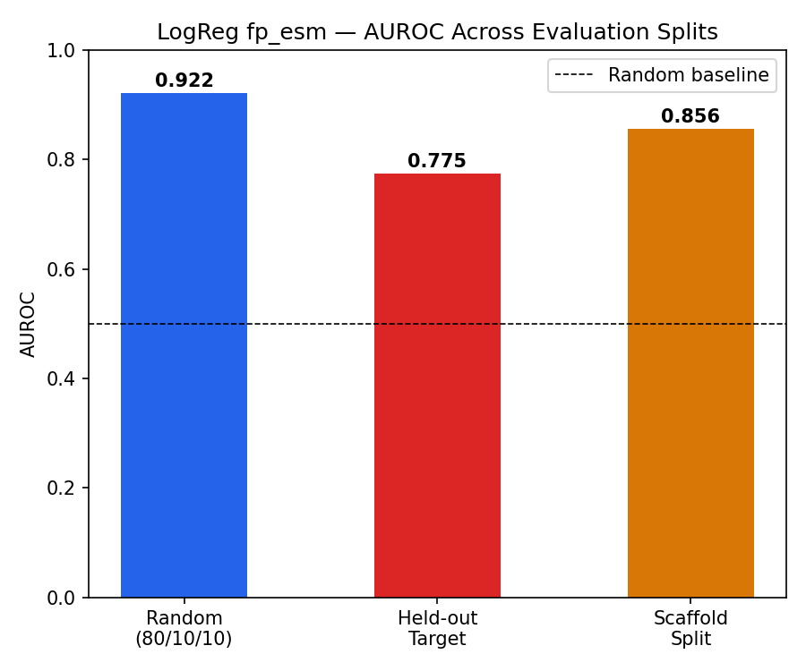
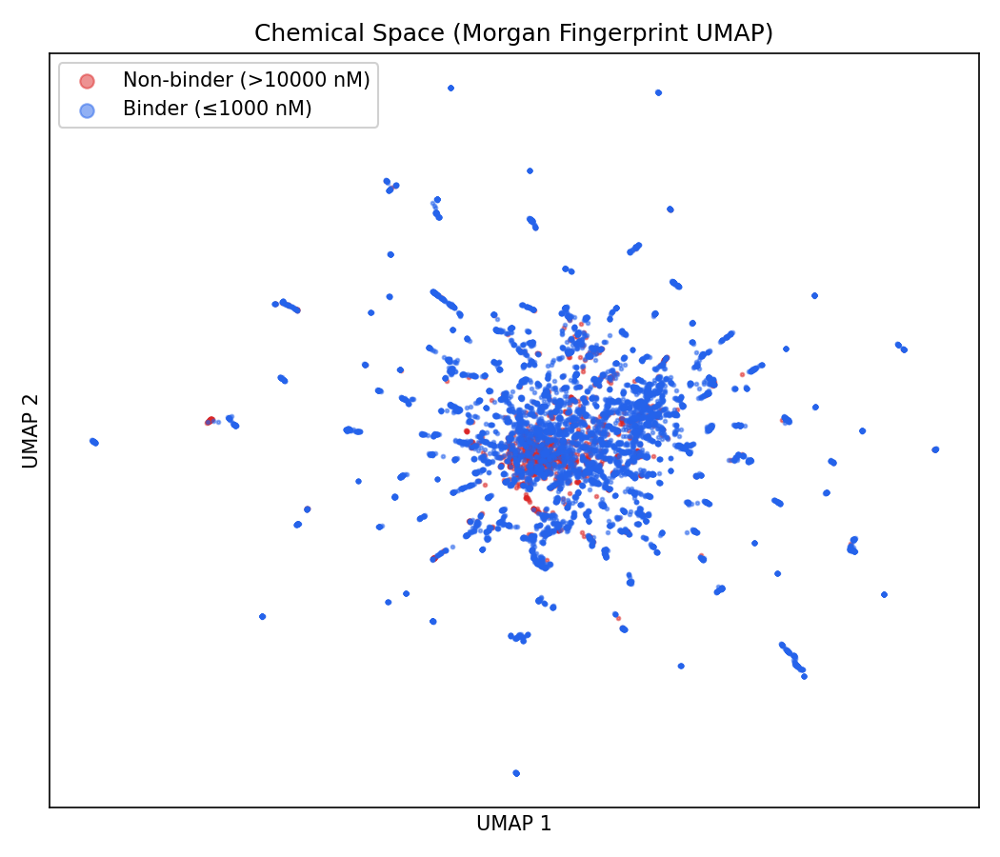
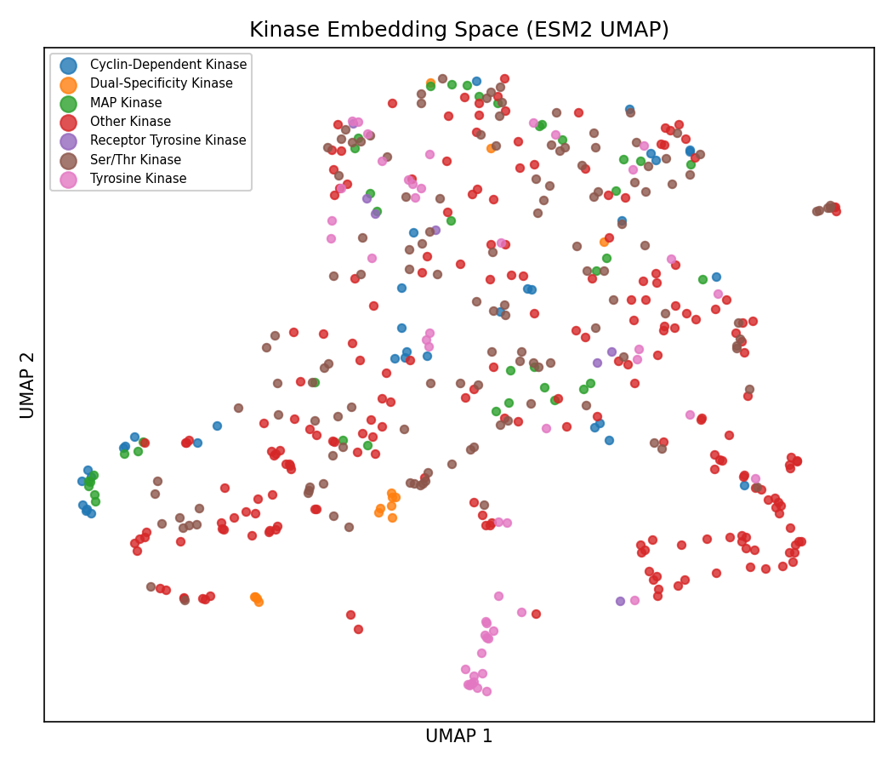
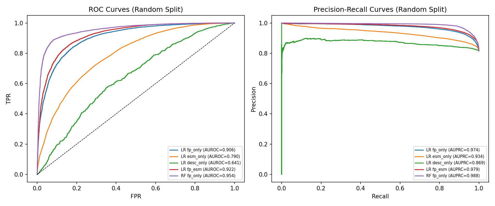
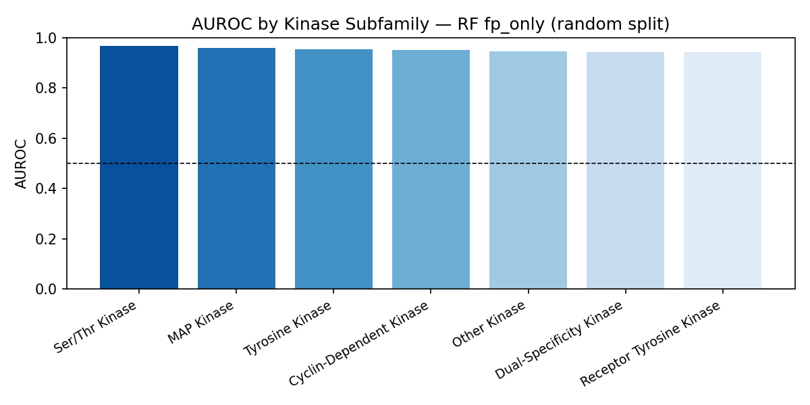
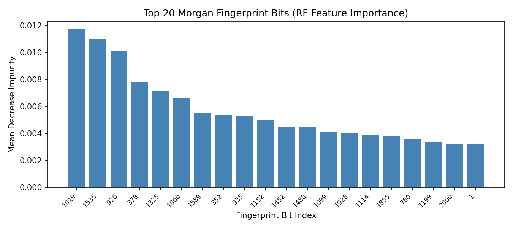

# bindscape: Drug-Target Interaction Prediction from Sequence Representations

Can a machine learning model predict whether a small molecule binds a protein target using only amino acid sequence and chemical structure, with no 3D structure, no docking, and no experimental data beyond binding affinity labels? This project tests that question on the most clinically relevant protein family in existence: human kinases. Each sample is a (drug, protein) pair. Drug → Morgan circular fingerprint (2048-bit, radius 2). Protein → ESM2 mean-pool embedding (`facebook/esm2_t30_150M_UR50D`, 640-dim). Label → 1 if Ki/IC50/Kd ≤ 1000 nM (binder), 0 if > 10,000 nM (non-binder); the ambiguous 1–10 μM band is dropped. On a random split, logistic regression combining both representations achieves AUROC 0.922. On 97 kinase targets withheld entirely from training, that drops to 0.775. That is the number that matters.

---

## Pipeline at a glance

1. Filter BindingDB to human kinase pairs with valid SMILES and measured affinity; apply 1 μM / 10 μM thresholds to assign binary labels.
2. Compute Morgan circular fingerprints for each unique drug (RDKit, radius=2, 2048 bits) and cache.
3. Fetch UniProt amino acid sequences for all kinase targets; embed with ESM2 mean-pool; cache to disk.
4. Construct feature matrices for four representation combinations; build three train/test splits before fitting any model.
5. Fit logistic regression and random forest; evaluate AUROC, AUPRC, and F1 across all model × feature × split combinations.

---

## Biological context

**Kinase inhibitors and drug discovery.** A kinase is an enzyme that transfers a phosphate group to a substrate protein, acting as the on/off switch of cell signaling. When kinase activity is dysregulated, it drives cancer, inflammation, and metabolic disease; over 70 FDA-approved kinase inhibitor drugs exist as of 2024. In early drug discovery, computational virtual screening filters chemical libraries before any wet-lab assay. Predicting binding from sequence alone, without solving a structure or running a docking simulation, is the cheapest possible computational filter and the one most accessible to sequence-trained models.

**Why kinases specifically.** Kinases are the most drug-targeted and most data-rich protein family in BindingDB. Their clear subfamily structure (tyrosine kinases, serine/threonine kinases, receptor tyrosine kinases, etc.) enables stratified evaluation: does the model generalize uniformly across subfamilies, or is performance concentrated in one well-represented family?

**Affinity thresholds.** Ki, IC50, and Kd all measure binding but are not interchangeable. When a pair has measurements from multiple assay types, the most thermodynamically reliable is used (Ki > Kd > IC50 > EC50). The 1 μM threshold for binary classification is standard: below it, binding is considered meaningful; above 10 μM, it is functionally irrelevant in most contexts.

---

## Data

**BindingDB**: full database (~2 GB compressed TSV), filtered to:
- Human targets only
- Target name contains "kinase" (case-insensitive)
- Valid SMILES (RDKit-parseable), non-null UniProt ID
- Affinity ≤ 1000 nM → binder; > 10,000 nM → non-binder; middle band dropped

**Negative sampling.** BindingDB records only measured interactions; most measured pairs are positive. Affinity-threshold negatives (Ki > 10 μM) are used as the primary negative class: real experiments with real affinity values, not assumed non-binders. The resulting class ratio is 4.43:1 positive:negative. No random negative augmentation applied (ratio < 10:1). No `class_weight='balanced'` applied to logistic regression (ratio < 5:1 threshold).

Final dataset: **456,674 (drug, protein) pairs**, **495 unique human kinase targets**, **222,934 unique drugs**.

---

## Representations

**Drug: Morgan circular fingerprint.** Each unique SMILES is converted to a 2048-bit binary vector using RDKit's Morgan algorithm at radius 2. The fingerprint encodes 2D molecular topology: which substructures are present within 4-bond neighborhoods of each heavy atom, not 3D geometry or conformation. Morgan fingerprints are the standard for bioactivity modeling because they directly capture the atomic arrangements that determine molecular interactions. Bits are binary (0/1) and are not standardized. As a secondary feature set for ablation, seven Lipinski physicochemical descriptors (MW, LogP, HBD, HBA, TPSA, RotBonds, AromaticRings) are also computed; they capture bulk drug-likeness properties rather than chemical topology and serve as a lower-bound baseline.

**Protein: ESM2 mean-pool embedding.** Amino acid sequences for all 495 kinase targets are fetched from UniProt and embedded using `facebook/esm2_t30_150M_UR50D` (640-dim output). ESM2 is a general-purpose protein language model trained on hundreds of millions of sequences across all protein families; it was not trained on kinases or on binding data. The mean-pool vector compresses the per-residue representation into a fixed-size input for classical classifiers, using the same pooling method as project 1 to allow a direct comparison. The 650M parameter model (`esm2_t33_650M_UR50D`) specified in the original design was infeasible on 8 GB CPU; the 150M model was substituted. Mean-pooling averages `last_hidden_state[:, 1:-1, :]` over residue positions, excluding BOS and EOS tokens. Sequences longer than 1022 residues are truncated to the first 1022; 87 of 487 sequences with valid embeddings (17.9%) required truncation. Embeddings are standardized (StandardScaler fit on split-1 training set).

**Four feature combinations for ablation:**

| Name | Dimensionality | Contents |
|---|---|---|
| `fp_only` | 2048 | Morgan fingerprint |
| `esm_only` | 640 | ESM2 protein embedding |
| `desc_only` | 7 | Lipinski descriptors |
| `fp_esm` | 2688 | Morgan fingerprint + ESM2 concatenated |

---

## Evaluation design

Three train/test splits, all built before any model is fit.

**Split 1 — random (80/10/10).** Pairs are shuffled and split (train 365,338 / val 45,668 / test 45,668). Validation set is used only for classification threshold selection; no hyperparameters are tuned on it. This is the standard benchmark and the optimistic AUROC estimate.

**Split 2 — held-out target.** 20% of unique UniProt IDs (97 proteins) are withheld entirely from training (train 364,115 / test 92,559). Tests the realistic deployment scenario: the model must generalize to a kinase with no training measurements. If the model fails here, ESM2 embeddings are not encoding transferable binding specificity.

**Split 3 — scaffold split.** Drugs are grouped by Murcko scaffold (RDKit). 20% of unique scaffolds (15,278) are withheld from training (train 365,680 / test 90,994). Tests whether Morgan fingerprints memorize known scaffolds or encode features that transfer to novel chemical series.

---

## Results

AUROC (area under the ROC curve) measures whether the model ranks true binders above non-binders: 0.5 is random, 1.0 is perfect.



| Model | Features | Split | AUROC | AUPRC | F1 |
|---|---|---|---|---|---|
| LogReg | desc_only | random | 0.641 | 0.869 | 0.899 |
| LogReg | esm_only | random | 0.790 | 0.934 | 0.911 |
| LogReg | fp_only | random | 0.906 | 0.974 | 0.931 |
| LogReg | fp_esm | random | 0.922 | 0.979 | 0.937 |
| RF | fp_only | random | 0.954 | 0.988 | 0.946 |
| LogReg | fp_esm | scaffold | 0.856 | 0.954 | 0.920 |
| **LogReg** | **fp_esm** | **held-out target** | **0.775** | **0.922** | **0.884** |

RF fp_esm was not evaluated; estimated 14.9 GB RAM required for 300 trees on 365k × 2688 features, with 2.2 GB available at fit time. RF fp_only is reported instead.

**Note on AUPRC.** Positive class prevalence is 372,555 / 456,674 ≈ 0.816. A trivial classifier that always predicts positive achieves AUPRC ≈ 0.82. desc_only AUPRC of 0.869 is only 0.053 above that baseline; discriminative signal is marginal. For fp_only and fp_esm (AUPRC 0.974–0.988), the gap from baseline is meaningful (+0.16). AUROC is the primary metric; at this positive prevalence, AUPRC should not be compared against balanced-dataset benchmarks from the literature.

---

## Interpretation

The honest number is 0.775. On 97 kinase targets withheld entirely from training, LogReg fp_esm drops 0.147 AUROC points from the random split; 0.775 is well above chance, but the gap is real. Part of what the random split rewards is learning which drugs tend to appear alongside which specific proteins in the training data. That co-occurrence pattern does not transfer to unseen kinases.

The scaffold split drop is smaller: 0.066 AUROC points, from 0.922 to 0.856. Morgan fingerprints transfer across novel chemical series more readily than ESM2 embeddings transfer across unseen protein targets. The drug-side drop is the weaker generalization test because ATP-competitive kinase inhibitors share pharmacophoric requirements regardless of scaffold; structural novelty on the drug side is less challenging than target novelty on the protein side.

ESM2 mean-pool embeddings carry genuine binding information on their own: esm_only reaches AUROC 0.790, and fp_esm outperforms fp_only by +0.016 on the random split. The protein representation adds discriminative signal. Different kinases bind different drug profiles, and ESM2 partially encodes those differences from sequence alone. The gain is real and modest, bounded by two hardware-forced constraints: the 150M model substitution (640-dim vs the 1280-dim 650M model originally intended) and 17.9% sequence truncation for multi-domain kinases where C-terminal domains are discarded before embedding. Whether the 650M model on full sequences would widen the fp_esm margin is unknown.

The Lipinski descriptor result rules out a shortcut worth ruling out. desc_only AUROC is 0.641, versus 0.906 for fp_only. Bulk drug-likeness properties do not distinguish kinase binders from non-binders. Kinase selectivity is encoded in detailed chemical topology, the specific atomic arrangements that engage the ATP-binding site and hinge region, not in seven numbers derived from bulk molecular properties.

Random forest outperforms logistic regression on Morgan fingerprints: RF fp_only achieves 0.954 vs LR fp_only 0.906. Fingerprint bits are correlated through shared substructural patterns, and their joint activation encodes binding information a linear model cannot capture. RF fp_esm was not evaluable due to RAM constraints; the ceiling on non-linear performance with combined representations is unknown.

Subfamily performance is consistent across the random-split test set (Fig. 4). No single kinase class drives the aggregate AUROC.

AUROC values in this table depend on the negative sampling strategy. Affinity-threshold negatives (Ki > 10 μM) are structurally similar to known binders because experimenters disproportionately test compounds they expect to bind; the negative class is not a random draw from chemical space. Performance on a prospective virtual screening task, where true non-binders span all of structural diversity, would likely be lower.

---

## Figures

| | |
|:---:|:---:|
|  |  |
| **Fig 1.** Chemical space UMAP over Morgan fingerprints of 10k subsampled drugs (cosine metric). Non-binders (red) are sparse at 4.43:1 class ratio and mostly invisible at this scale. The tight clustering reflects the narrow chemical diversity of BindingDB's kinase inhibitor collection: measured compounds are concentrated in ATP-competitive scaffold classes that occupy the same region of chemical space. | **Fig 2.** ESM2 embedding UMAP over all 487 kinase targets with valid sequences, colored by subfamily. ESM2 partially separates kinase families despite being trained on general protein sequences. |



**Fig 3.** ROC (left) and precision-recall (right) curves for all model × feature combinations on the random split.

| | |
|:---:|:---:|
|  |  |
| **Fig 4.** AUROC by kinase subfamily for the best random-split model (RF fp_only, AUROC 0.954). Performance is consistent across families. | **Fig 5.** Top 20 Morgan fingerprint bit positions by RF mean decrease in impurity. |


**Fig 6.** LogReg fp_esm AUROC across all three evaluation splits. The gap between random (0.922) and held-out target (0.775) is the key methodological result.

---

## Limitations

**Model size.** The 650M ESM2 model (`esm2_t33_650M_UR50D`) was infeasible on 8 GB CPU. The 150M model (`esm2_t30_150M_UR50D`, 640-dim) was substituted. The fp_esm margin over fp_only (+0.016) may be underestimated; the larger model provides richer representations and might yield a wider gap.

**Sequence truncation.** 87 of 487 kinase sequences with valid embeddings (17.9%) were truncated to 1022 residues before ESM2 embedding, exceeding the 10% flag threshold. Affected proteins are multi-domain kinases where the C-terminal regulatory or kinase domain is partially or fully discarded. Truncation degrades embedding quality for these proteins and may compress the true held-out target AUROC.

**RAM constraints on RF.** Random forest could not be evaluated on `fp_esm` (2688-dim, 365k training samples, 300 trees, estimated 14.9 GB). The ceiling on combined fingerprint + protein embedding performance under a nonlinear model is unknown.

**Negative sampling.** Affinity-threshold negatives are not a random sample from chemical space. Reported AUROC values are not directly comparable to benchmarks using random or decoy negatives.

**No hyperparameter tuning.** Logistic regression C=1.0, RF n_estimators=300 are used unchanged. The goal is representation analysis, not maximum AUROC.

**ESM2 mean-pool EOS handling.** The original pooling implementation excluded the EOS token only for the longest sequence in each batch; shorter sequences included EOS in the mean. For kinase-length sequences (250–900 aa) this is a sub-0.5% contamination per embedding and does not change any reported finding. The implementation has been corrected in `src/embed.py`: EOS is explicitly zeroed for every sequence regardless of batch position. Cached embeddings used for the reported results were computed under the original implementation.

---

## Connection to project 1

Project 1 (`antibody-sequence-landscape`) asked: does ESM2 encode species-level biological structure in VH antibody sequences? Answer: yes. ESM2 CLS captures inter-species separation (silhouette=0.134), mean-pool degrades it (−0.073, CI excludes zero), and AntiBERTy strongly outperforms (sil=0.310) due to antibody-specific pretraining.

This project uses the same embedding method (ESM2 mean-pool), a larger model, and a different protein family to ask a functional rather than structural question: does ESM2 mean-pool encode binding specificity well enough to contribute to drug-target interaction prediction? The evaluation philosophy is the same: report point estimates under honest splits, not just the optimistic number.

ESM2 mean-pool on kinases carries real predictive signal (esm_only AUROC 0.790; fp_esm outperforms fp_only by +0.016), but the fingerprint accounts for the majority of it. The protein embedding contributes, but less than expected for the most drug-targeted protein family in existence, where selectivity is hard-won and not determined by bulk sequence similarity alone.

---

## Structure

```
notebook.ipynb              # full analysis: data → features → models → eval → figures
src/
  data.py                   # BindingDB parse, kinase filter, affinity threshold
  embed.py                  # ESM2 mean-pool; batched; checkpointed; cached
  fingerprint.py            # Morgan fingerprints and physicochemical descriptors
figures/                    # output PNGs (figs 1–6)  [committed]
cache/                      # fingerprint arrays, ESM2 embeddings  [gitignored — auto-populated on first run]
data/                       # place BindingDB_All.tsv here before running  [committed empty; pickles gitignored]
models/                     # fitted model joblibs  [gitignored — auto-populated on first run]
requirements.txt
```

A fresh clone contains source files, committed figures, and an empty `data/` directory ready for the BindingDB TSV. `cache/` and `models/` are created automatically by the notebook on first run.

---

## Setup

```bash
conda create -n bindscape python=3.11
conda activate bindscape
conda install -c conda-forge rdkit
pip install -r requirements.txt
```

**Data.** Download `BindingDB_All.tsv.zip` from bindingdb.org and extract directly into the `data/` directory that comes with the clone: `data/BindingDB_All.tsv`. The notebook expects that exact path. The file is ~2 GB compressed, ~10 GB extracted.

**Runtime.** All cells are cached. On first run, expect ~15 minutes for fingerprint computation (222k unique SMILES), ~30 minutes for ESM2 embedding (487 sequences, CPU), and ~10 minutes for the scaffold column (456k rows). Subsequent runs load from cache and complete in under 5 minutes. Hardware: CPU only, 8 GB RAM, Apple Silicon (darwin).

**Dependencies:** transformers, torch (CPU), scikit-learn, rdkit, umap-learn, numpy, pandas, matplotlib, seaborn, requests, psutil, joblib. Pin versions from `requirements.txt`.
